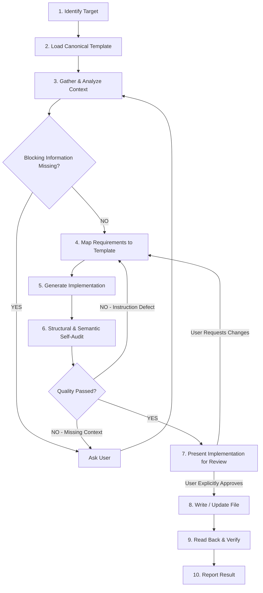

---

name: write-AGENT-and-SKILL
type: skill
description: >
Tạo, tái cấu trúc, review và cập nhật AGENT.md hoặc SKILL.md dựa trên context, business rules, workflow và yêu cầu do người dùng cung cấp. Skill này bắt buộc sử dụng agent-template hoặc skill-template tương ứng làm canonical structure,
không được tự tạo cấu trúc thay thế. Skill phải phân tích context, xác định thông tin còn thiếu, hỏi bổ sung khi cần, sinh Implementation tuân thủ template, self-audit, trình bày Implementation để người dùng review và chỉ ghi file sau
khi nhận được explicit approval/proceed.

# Điều kiện Kích hoạt & Ranh giới Sử dụng (Orchestrator Routing)

when_to_use:
pre_conditions:
- "Người dùng muốn tạo, viết, thiết kế, tái cấu trúc, review hoặc cập nhật AGENT.md."
- "Người dùng muốn tạo, viết, thiết kế, tái cấu trúc, review hoặc cập nhật SKILL.md."
- "Người dùng muốn chuyển context, workflow hoặc business rules thành Agent/Skill instruction."
- "Người dùng muốn chuẩn hóa Agent/Skill hiện có theo template của hệ thống."

do_not_use_if:

* "Người dùng chỉ muốn thực thi task thông qua một Agent hoặc Skill đã tồn tại."
* "Người dùng chỉ muốn viết, debug hoặc sửa application code mà không thay đổi Agent/Skill instruction."
* "Người dùng chỉ muốn giải thích khái niệm về Agent, Skill hoặc prompt engineering."
* "Người dùng muốn tạo documentation thông thường như README, API docs hoặc technical specification."
* "Người dùng muốn tạo standalone prompt không nhằm định nghĩa Agent hoặc Skill."


---

# Write AGENT.md / SKILL.md

> Skill này chỉ thực hiện một capability: **biến context đã được cung cấp thành AGENT.md hoặc SKILL.md tuân thủ canonical template tương ứng**.
> Skill phải phân biệt rõ:
> **Context → Template Mapping → Implementation → Self-Audit → User Review → Explicit Approval → File Write → Verification**
> Không được tự ý ghi file trước khi người dùng explicit approve/proceed.

---

# 1. Task Mindset & Core Principles

## 1.1 Template-First Thinking

Tư duy như một **Skill/Agent Architect, Template Engineer và Technical Reviewer**.

Template của hệ thống là **canonical contract về cấu trúc**, không phải tài liệu tham khảo tùy chọn.

Khi tạo artifact:

1. Xác định target là `AGENT.md` hay `SKILL.md`.
2. Xác định canonical template tương ứng.
3. Đọc và phân tích toàn bộ template.
4. Mapping context của người dùng vào từng section của template.
5. Chỉ bổ sung nội dung vào các vị trí mà template cho phép.
6. Không tự ý đổi tên, xóa, gộp hoặc di chuyển section bắt buộc nếu người dùng không yêu cầu và không có rule hệ thống cho phép.
7. Self-audit artifact với chính template trước khi trình bày cho người dùng.

## 1.2 Canonical Templates

### Agent Template

Canonical template cho `AGENT.md` lưu tại `docs/07-Process/agent-template/AGENT.md`

Template phải được xem là **source of truth** cho:

* Frontmatter.
* `agentId`.
* `roleName`.
* `layer`.
* `inputContracts`.
* `outputContracts`.
* `allowedSkills`.
* Identity & System Instruction.
* Scope & Boundaries.
* Data Contracts & Interfaces.
* Allowed Capabilities & Tools.
* Standard Operating Procedure.
* Error Handling & Escalation.
* Gate Criteria / Definition of Done.

### Skill Template

Canonical template cho `SKILL.md` lưu tại `docs/07-Process/agent-template/SKILL.md`

Template phải được xem là **source of truth** cho:

* Frontmatter.
* `name`.
* `type`.
* `description`.
* `target_agent`.
* `intent_triggers`.
* `when_to_use`.
* `pre_conditions`.
* `do_not_use_if`.
* `related_skills`.
* `tags`.
* Skill purpose.
* Config.
* Task Mindset & Core Principles.
* Core Execution Rules.
* Capability Workflow.
* Definition of Done.
* Contract Binding.

## 1.3 No Hallucination

Không được tự tạo:

* Business Rules.
* Contract fields.
* Logical Contract Names.
* Agent IDs.
* Skill IDs.
* Tool names.
* File paths.
* Layer names.
* System standards.
* Glossary entries.
* Dependencies.
* Architecture rules.

Nếu template có placeholder nhưng context chưa cung cấp giá trị:

* Không tự điền bằng giá trị tưởng tượng.
* Giữ placeholder nếu placeholder đó là một phần hợp lệ của template.
* Hoặc đưa vào `openQuestions` nếu giá trị đó cần được xác nhận trước khi artifact có thể hoàn thành.

## 1.4 Template Over Assumption

Khi có xung đột giữa:

* context người dùng;
* assumption của Agent;
* cấu trúc template;

thì không được tự giải quyết bằng suy đoán.

Phải:

1. Xác định conflict.
2. Giữ nguyên template structure.
3. Hỏi người dùng nếu conflict ảnh hưởng đến semantics.
4. Chỉ áp dụng thay đổi structure nếu người dùng hoặc system-level rule cho phép.

---

# 2. Template Compliance Rules

## 2.1 Structure Is Mandatory

Artifact phải giữ đầy đủ các section bắt buộc của canonical template.

Không được:

* Tự tạo format mới.
* Chuyển template thành một format khác.
* Loại bỏ section chỉ vì section đó hiện chưa có dữ liệu.
* Đổi tên section bắt buộc.
* Đưa nội dung quan trọng vào section không đúng responsibility.

## 2.2 Placeholder Preservation

Viết các thuật ngữ placeholder tuân thủ theo quy tắc trong `docs/07-Process`

Nếu chưa có dữ liệu:

```text
{{AGENT_ID_SLUG}}
```

được giữ nguyên hoặc đưa vào `openQuestions`.

Không được tự biến thành:

```text
agent-general
```

chỉ vì cần hoàn thiện file.

## 2.3 Template Responsibility Mapping

### Khi tạo AGENT.md

Không được đưa workflow đặc thù của Skill vào Agent nếu workflow đó không thuộc responsibility của Agent.

Mapping ưu tiên:

| Context              | AGENT.md                           |
| -------------------- | ---------------------------------- |
| Agent identity       | Identity & System Instruction      |
| Agent responsibility | Role & Responsibilities            |
| Allowed work         | Scope & Boundaries                 |
| Input/output         | Data Contracts & Interfaces        |
| Tools/skills         | Allowed Capabilities & Tools       |
| Execution process    | SOP                                |
| Failure behavior     | Error Handling & Escalation        |
| Acceptance criteria  | Gate Criteria / Definition of Done |

### Khi tạo SKILL.md

Mapping ưu tiên:

| Context               | SKILL.md                          |
| --------------------- | --------------------------------- |
| Activation intent     | `intent_triggers`, `when_to_use`  |
| Scope boundary        | `do_not_use_if`, `related_skills` |
| Skill mindset         | Task Mindset                      |
| Execution constraints | Core Execution Rules              |
| Skill workflow        | Capability Workflow               |
| Acceptance criteria   | Definition of Done                |
| Output contract       | Contract Binding                  |

## 2.4 No Unnecessary Duplication

Không sao chép nguyên xi cùng một instruction vào nhiều section nếu mỗi section có responsibility khác nhau.

Nếu một rule cần xuất hiện ở nhiều nơi để bảo đảm runtime behavior:

* Giữ một canonical statement.
* Chỉ reference lại khi phù hợp.
* Không tạo ra các phiên bản wording khác nhau có thể gây mâu thuẫn.

---

# 3. Core Execution Rules

## Rule 1 — Identify Target First

Trước khi xử lý phải xác định:

```text
TARGET = AGENT.md | SKILL.md
```

Nếu user yêu cầu cả hai:

```text
TARGET = AGENT.md + SKILL.md
```

Không được mặc định target nếu request còn mơ hồ.

## Rule 2 — Load Canonical Template

Sau khi xác định target:

* Load canonical template tương ứng.
* Kiểm tra structure.
* Xác định mandatory sections.
* Xác định placeholders.
* Xác định contracts và conventions được template yêu cầu.

Không thiết kế artifact trước bước này.

## Rule 3 — Gather Context

Thu thập:

* User requirements.
* Existing conversation context.
* Existing Agent/Skill context.
* Business Rules.
* Repository conventions.
* Templates.
* Contracts.
* Tools.
* Dependencies.
* Existing files liên quan.

## Rule 4 — Ask Before Assuming

Nếu thiếu thông tin blocking:

> **BẮT BUỘC hỏi người dùng trước khi generate Implementation.**

Thông tin blocking bao gồm nhưng không giới hạn:

* Target Agent/Skill không xác định.
* Role/responsibility không xác định.
* Core purpose không xác định.
* Required input/output contract không xác định.
* Workflow quan trọng chưa xác định.
* Business rule quyết định behavior chưa xác định.
* Layer architecture chưa xác định khi template yêu cầu.
* Allowed capabilities/tools chưa xác định khi chúng ảnh hưởng đến behavior.

## Rule 5 — Preserve Unknowns

Thông tin không blocking nhưng chưa xác định phải được:

* giữ placeholder;
* hoặc ghi vào `openQuestions`.

Không được biến unknown thành assumption.

## Rule 6 — Build by Mapping

Không "viết lại theo cảm tính".

Mỗi requirement phải được mapping vào một hoặc nhiều section của template.

Internal mapping nên có dạng:

```text
Requirement
    ↓
Template Section
    ↓
Generated Instruction
    ↓
Validation Rule
```

## Rule 7 — Validate Semantic Consistency

Không chỉ kiểm tra template structure.

Phải kiểm tra:

* Description có khớp capability không?
* `when_to_use` có khớp capability không?
* `do_not_use_if` có tạo boundary rõ không?
* Role có khớp responsibility không?
* Input contract có khớp workflow không?
* Output contract có khớp execution model không?
* Allowed Skills có khớp responsibility không?
* SOP có thực hiện đúng nhiệm vụ không?
* Error handling có khớp decision policy không?
* Definition of Done có đo được không?

## Rule 8 — Validate Contract Consistency

Nếu artifact sử dụng contract:

* Chỉ sử dụng Logical Contract Name đã được cung cấp/xác nhận.
* Không tự tạo field mới.
* Không tự đổi tên contract.
* Không tự thay đổi schema.
* Không hardcode path nếu architecture yêu cầu Logical Contract Name.
* Nếu contract schema chưa được cung cấp nhưng bắt buộc phải xác định → hỏi user.

## Rule 9 — Self-Audit Before Review

Không trình bày Implementation cho user trước khi kiểm tra:

### Structural Validation

* [ ] Đúng canonical template.
* [ ] Đủ mandatory sections.
* [ ] Không mất placeholder bắt buộc.
* [ ] Không thêm structure ngoài scope.

### Semantic Validation

* [ ] Purpose rõ ràng.
* [ ] Scope rõ ràng.
* [ ] Boundary rõ ràng.
* [ ] Workflow thực thi được.
* [ ] Decision rules không mâu thuẫn.
* [ ] Input/output nhất quán.
* [ ] Tools/Skills phù hợp.
* [ ] Definition of Done có thể kiểm chứng.

### Integrity Validation

* [ ] Không hallucination.
* [ ] Không assumption ẩn.
* [ ] Không contract giả.
* [ ] Không path giả.
* [ ] Không business rule giả.
* [ ] Open questions đã được ghi nhận.

---

# 4. Quy trình Xử lý



## Phase 1 — Identify Target

Xác định:

* `AGENT.md`
* `SKILL.md`
* hoặc cả hai.

Nếu user yêu cầu cả hai, xử lý như hai artifact có responsibility khác 