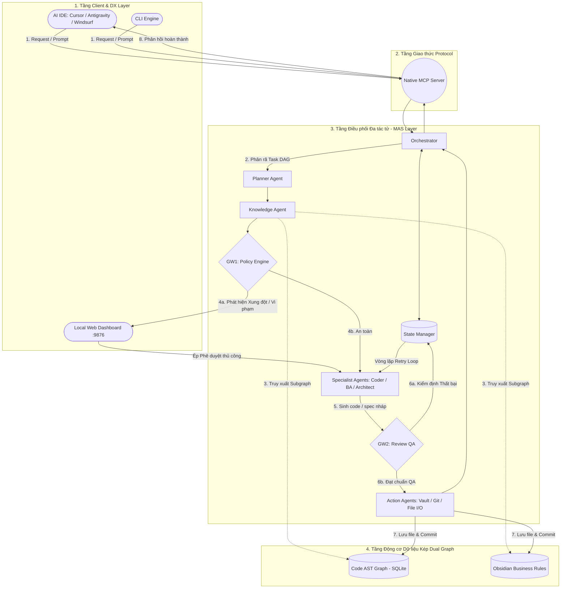
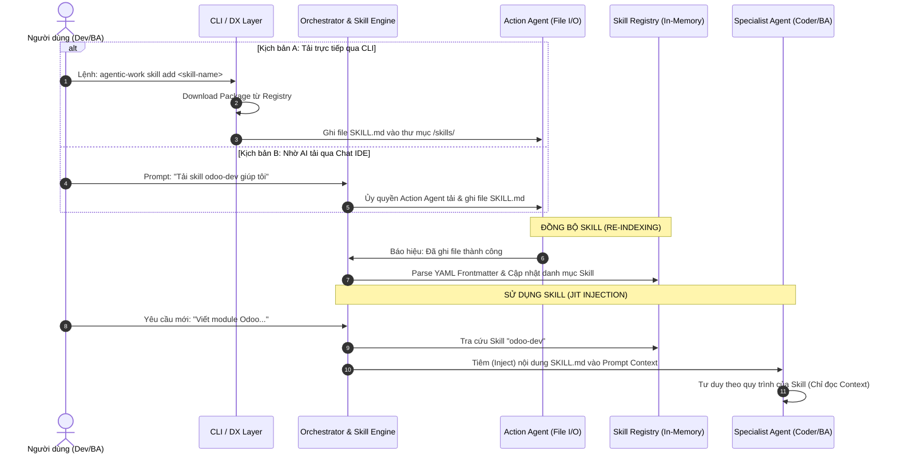

# Kiến trúc Hệ thống & Luồng Điều phối Đa tác tử (Multi-Agent System Architecture)

> **Tài liệu Chi tiết về Kiến trúc Phân tầng, Phân chia Agent, Cơ chế Kiểm duyệt, Đồng bộ Skill & Tích hợp Thư viện Bên thứ ba (3rd-Party Skills)**

---

## 1. Kiến trúc 4 Tầng & Phân chia Agent (4-Layered Multi-Agent Architecture)

Hệ thống **Agentic Work (AutoForge)** được thiết kế theo mô hình 4 tầng nghiêm ngặt với nguyên tắc phân tách ranh giới rõ ràng: **Tầng dưới không gọi ngược lên tầng trên, Agent tư duy không được ghi trực tiếp vào ổ đĩa.**



### Phân loại các Agent trong Hệ thống

#### 🧠 a. Bộ Điều phối & Quản lý Trạng thái (Orchestration, Workflow Engine & State Management)
*   **Orchestrator (Workflow Engine):** "Bộ brain" trung tâm vận hành Động cơ Workflow theo các pattern của LangGraph (`STD-FW-002`). Quản lý độc quyền `WorkflowState`, phân loại ý định (Intent Classification) và điều phối luồng dữ liệu giữa các Node (Agent/Skill) thông qua Hợp đồng Dữ liệu (Contract-based Execution). **Tuyệt đối không cho phép Agent giao tiếp trực tiếp với nhau.**
*   **Planner Agent (Task Orchestrator):** Phân rã prompt phức tạp thành **Đồ thị Công việc (Task DAG - Directed Acyclic Graph)**.
*   **Knowledge Agent (Context Orchestrator):** Phân tích ý định ngữ cảnh, suy luận phụ thuộc, bóc tách **Code AST Graph** & **Business Rules**, tối ưu Token và chuẩn bị bối cảnh chuẩn xác nhất cho các Specialist Agents.
*   **State Manager & WorkflowState:** Quản lý context window, bộ nhớ phiên làm việc, lưu giữ snapshot trạng thái (`Checkpoint`) phục vụ Human-in-the-Loop và đếm số vòng lặp sửa lỗi (**Retry Loop Counter**).

#### 🔀 b. Kiến trúc 3 Tầng Workflow (Multi-Layer Workflow Hierarchy)
*   **Layer 1 - Orchestrator Workflow (High-Level DAG):** Luồng đồ thị điều phối giữa các Agent (`Planner → Knowledge → Specialist Agent → Gateway → Action Agent`).
*   **Layer 2 - Agent Workflow (Agent Internal Flow):** Luồng tư duy nghiệp vụ nội bộ của từng Sub-Agent.
*   **Layer 3 - Skill Workflow (Capability Execution Flow):** Mô hình hóa bản thân từng Skill dưới dạng một **Capability Graph** (`Prepare → Ask → Update → Evaluate → Loop → Finalize`). Skill không còn là Prompt dài tĩnh.

#### 💡 b. Tác tử Chuyên gia (Specialist Agents — Chỉ Tư duy, KHÔNG ghi file)
> **Nguyên tắc An toàn:** Nhóm này chỉ hoạt động trong RAM/Context để suy luận, phân tích và sinh code/spec nháp, **tuyệt đối không có quyền gọi File System API hay Git API**.

*   **BA Agent:** Phỏng vấn Socratic, làm rõ Change Request (CR), xác định scope/edge cases (sử dụng skill `requirements-interview`).
*   **Architect Agent:** Phân tích kiến trúc và tính toán **Bán kính ảnh hưởng (Blast Radius)**.
*   **Coder Agent (Backend/Frontend/Database):** Sinh mã nguồn theo framework mục tiêu (React, NestJS, Odoo...).
*   **Tester / Reviewer Agent:** Đánh giá mã nguồn hoặc spec sinh ra theo tiêu chuẩn chất lượng.

#### 🛡️ c. Chốt chặn Kiểm duyệt (Gateways)
*   **Gateway 1 (Policy Engine - Kiểm duyệt tiền thực thi):** Đối chiếu Task DAG với tập quy tắc nghiệp vụ (**Business Rules**). Nếu có xung đột, dừng luồng và cảnh báo lên Local Web Dashboard (`localhost:9876`) chờ người dùng duyệt (**Human-in-the-Loop**).
*   **Gateway 2 (Review QA - Kiểm duyệt hậu thực thi):** Kiểm tra mã nguồn/tài liệu sinh ra. Nếu không đạt chuẩn, kích hoạt **Retry Loop** yêu cầu Specialist Agent tự sửa lỗi.

#### ⚡ d. Tác tử Hành động (Action Agents — Chỉ Thực thi Đọc/Ghi/Mutations)
> **Nguyên tắc An toàn:** Nhóm này là các Execution Workers thuần túy (stateless), không chứa logic tư duy phức tạp, chỉ thực thi các tác động làm thay đổi trạng thái bên ngoài (Side-Effects / Disk Mutations) sau khi đã vượt qua Gateway 2.

*   **Vault / File System Agent:** Thực hiện tạo, sửa, xóa file Markdown hoặc mã nguồn trên đĩa.
*   **Git Agent:** Khởi tạo branch, tạo commit và push code lên repository.
*   **Runner Agent:** Chạy các lệnh terminal (build, test, `npm install`).

---

## 2. Cơ chế Đồng bộ Skill khi chỉ Action Agent có quyền Đọc/Ghi

Hệ thống phân định ranh giới rõ ràng giữa **Hành động Hạ tầng (CLI/System)** và **Vòng lặp Tư duy (Agent Runtime Loop)**.



### Tiêm Kỹ năng Động (JIT - Just-In-Time Skill Injection)
1. **Ghi đĩa:** Thao tác tải và lưu `SKILL.md` chỉ do **CLI** hoặc **Action Agent** thực hiện vào thư mục `skills/`.
2. **Indexing:** **Skill Engine** quét phần YAML Frontmatter (`name`, `description`, `triggers`) và đăng ký vào **Skill Registry**.
3. **Execution:** Khi có request cần dùng Skill, Orchestrator đọc `SKILL.md` và **tiêm (inject) trực tiếp vào Prompt Context** của Specialist Agent. Specialist Agent hoàn toàn không cần quyền ghi đĩa để sử dụng Skill.

---

## 3. Cơ chế Xử lý Skill từ Bên Thứ Ba (3rd-Party Skills Integration)

Khi tích hợp các Skill từ bên thứ ba (Obsidian Hub, Cursor Market, GitHub Repos, NPM Packages), hệ thống giải quyết 3 bài toán lớn bằng **Tầng đệm Chuẩn hóa (Skill Adapter & Output Standardization Layer)**.

### Vấn đề 1: Thiếu hoặc Sai chuẩn YAML Frontmatter
*   **Giải pháp:** **Skill Ingestion & Adapter Pipeline**.
*   Khi tải một skill 3rd-party thô, **Skill Engine Parser** (sử dụng LLM nhỏ/nhanh) sẽ tự động đọc lướt file:
    *   Trích xuất Tiêu đề H1 $\rightarrow$ `name`.
    *   Trích xuất Đoạn văn đầu $\rightarrow$ `description`.
    *   Trích xuất Từ khóa chính $\rightarrow$ `triggers`.
*   Tự động sinh khối YAML Frontmatter chuẩn hóa hoặc lưu file sidecar `.[skill-name].meta.json`.

### Vấn đề 2: Không biết Skill cần Input/Ngữ cảnh gì
*   **Giải pháp:** **Dynamic Context Inference (Suy luận Ngữ cảnh Động)**.
    *   *Chế độ Explicit:* Đọc trường `requires` nếu Skill 3rd-party có khai báo.
    *   *Chế độ Implicit:* **Knowledge Agent** sử dụng **Semantic Intent Engine** để đọc lướt prompt người dùng + nội dung Skill. Nhận diện từ khóa (như `database`, `API`, `policy`...) để tự động bóc tách đúng Subgraph (Code AST hay Business Rules) nạp cho Specialist Agent.

### Vấn đề 3: Đầu ra Đa dạng (Tạo file, Sửa file, Chat text)
*   **Giải pháp:** **Standardized Output Envelope (Giao ước Đầu ra Chuẩn hóa)**.
*   Mọi Specialist Agent khi thực thi Skill 3rd-party đều bị **chặn (intercept)** và ép đóng gói kết quả vào cấu trúc JSON Payload chuẩn:

```typescript
interface SkillExecutionResult {
  executionType: 'FILE_CREATE' | 'FILE_MODIFY' | 'FILE_DELETE' | 'CHAT_RESPONSE';
  
  // Danh sách các thay đổi đề xuất (Nếu có)
  payload?: {
    targetPath: string;      // Đường dẫn file mục tiêu
    content: string;         // Nội dung mới
    diff?: string;           // Đoạn diff sửa đổi
  }[];

  // Kết quả dạng văn bản/Chat (Nếu là trả lời trực tiếp)
  chatMessage?: string;

  // Metadata phụ trợ để QA kiểm duyệt
  metadata: {
    skillUsed: string;
    affectedModules: string[];
  };
}
```

*   Envelope này được gửi tới **GW2 (Review QA)** để kiểm định. Sau khi GW2 duyệt, **Action Agent** mới nhận payload và thực hiện lưu đĩa/commit.

---

## 4. Tối ưu Token & Quản lý Phụ thuộc Phức tạp (Ví dụ với `react-bits`)

Khi tích hợp một thư viện/Skill lớn như **[react-bits](https://github.com/DavidHDev/react-bits)** (chứa hàng trăm UI components/animations), hệ thống áp dụng 2 kỹ thuật tối ưu:

### a. Tối ưu Token: Chỉ mục 2 Tầng (Hierarchical Lazy-Loading)
*   **Tầng 1 - Catalog Indexing (0 LLM Token):** Khi nạp `react-bits`, **Skill Engine** dùng static AST parser quét cây thư mục và tạo file catalog siêu nhẹ `catalog.json` (~300 tokens):
    ```json
    {
      "skill_id": "react-bits",
      "components": {
        "SpotlightCard": { "path": "Components/SpotlightCard/SpotlightCard.jsx", "tags": ["card", "spotlight"] },
        "BlurText": { "path": "TextAnimations/BlurText/BlurText.jsx", "tags": ["text", "animation"] }
      }
    }
    ```
*   **Tầng 2 - Dynamic Lazy Loading:** Khi người dùng yêu cầu: *"Thêm SpotlightCard cho trang Pricing"*, Knowledge Agent **CHỈ đọc duy nhất 1 file `SpotlightCard.jsx`** (~800 tokens), tiết kiệm 99% token so với nạp toàn bộ repo `react-bits` (~150.000 tokens).

### b. Quản lý Phụ thuộc: AST Import Resolution & GW2 Safety Net
*   **Lớp 1 (AST Import Resolution):** Knowledge Agent dùng AST Parser soi trực tiếp câu lệnh `import` trong file component (như `import { motion } from 'framer-motion'` hay `import { cn } from '@/lib/utils'`).
    *   Tự động check `package.json` $\rightarrow$ Nếu thiếu `framer-motion`, bổ sung task `npm install framer-motion` cho Action Agent.
    *   Tự động check file `utils` $\rightarrow$ Nếu thiếu hàm `cn()`, nạp mẫu hàm `cn()` để khởi tạo.
*   **Lớp 2 (GW2 Safety Net):** GW2 chạy Linter/TypeScript Compiler tĩnh. Nếu vẫn phát hiện sót dependency $\rightarrow$ Kích hoạt **Retry Loop** gửi thông báo lỗi chính xác để Knowledge Agent fetch bù.

---
*Tài liệu được khởi tạo và lưu trữ tự động tại `docs/00-System-Architecture.md`.*
