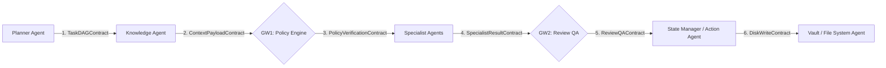
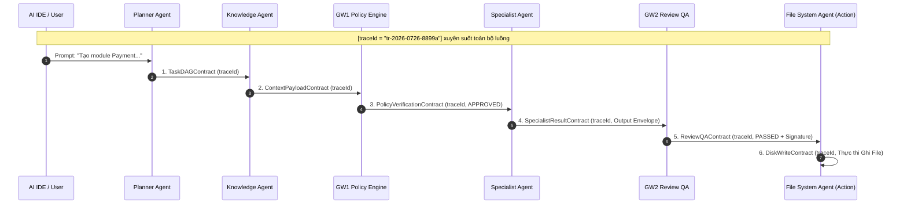

# Quy chuẩn Hợp đồng Dữ liệu giữa các Agent (Agent Data Contracts Specification)

> **Tài liệu Định nghĩa Chi tiết các Interface TypeScript & JSON Schemas Giao tiếp giữa các Agent trong Kiến trúc 4 Tầng của Agentic Work (AutoForge)**

---

## 1. Tổng quan về Hệ thống Hợp đồng Dữ liệu (Data Contracts Architecture)

Để đảm bảo nguyên tắc **Phân định Ranh giới Nhiệm vụ**, **Định vết Xuyên suốt (Distributed Tracing)** và **An toàn Mã nguồn tuyệt đối**, mọi dữ liệu truyền giữa các Agent trong hệ thống **Agentic Work** đều phải tuân thủ nghiêm ngặt các **Data Contracts (Hợp đồng Dữ liệu)** được định nghĩa bằng JSON Schema tại thư mục [`schemas/`](file:///d:/Workspace/Projects/AgenticWork/schemas).



> [!IMPORTANT]
> **Nguyên tắc Vàng:**
> 1. **Distributed Tracing (`traceId`):** Tất cả Contract đều kế thừa từ `BaseContract` chứa `traceId`. Một `traceId` duy nhất được khởi tạo từ lúc người dùng nhấn Enter trên IDE và được mang theo xuyên suốt toàn bộ vòng đời xử lý đến khi xuất file xuống ổ đĩa, giúp Dashboard kết nối Event Stream mà không cần join nhiều ID thủ công.
> 2. **No Untyped Data:** Không có bất kỳ dữ liệu văn bản tự nhiên (unstructured text) nào được truyền trực tiếp giữa các Agent mà không có Data Contract bao bọc.
> 3. **Action Agent Execution Barrier:** Action Agent (File System Agent) chỉ chấp nhận duy nhất [`DiskWriteContract`](file:///d:/Workspace/Projects/AgenticWork/schemas/disk-write.schema.json) đã được ký duyệt `PASSED` từ Gateway 2 (Review QA).

---

## 2. Hợp đồng Cơ sở (Base Contract)

Mọi Data Contract giữa các Agent đều phải mở rộng (extend) từ `BaseContract` sau:

```typescript
export interface BaseContract {
  traceId: string;   // Unique ID xuyên suốt 1 vòng đời request từ IDE đến Disk
  timestamp: string; // Thời điểm khởi tạo gói tin (ISO 8601)
}
```

---

## 3. Chi tiết 6 Hợp đồng Dữ liệu Cốt lõi

### 📌 3.1 `TaskDAGContract` (Planner Agent $\rightarrow$ Knowledge Agent & GW1)
*   **JSON Schema:** [`schemas/task-dag.schema.json`](file:///d:/Workspace/Projects/AgenticWork/schemas/task-dag.schema.json)
*   **Mục đích:** Đóng gói Đồ thị Công việc (Task DAG) do **Planner Agent** rã từ prompt của người dùng.

```typescript
export interface TaskDAGContract extends BaseContract {
  dagId: string;
  userPrompt: string;
  intentCategory: 'CODE_GEN' | 'REQUIREMENTS_REFINEMENT' | 'BUG_FIX' | 'ARCHITECTURE_DESIGN' | 'DOCUMENTATION';
  tasks: Array<{
    taskId: string;
    stepNumber: number;
    description: string;
    assignedRole: 'BA_AGENT' | 'ARCHITECT_AGENT' | 'CODER_AGENT' | 'DATABASE_AGENT' | 'TESTER_AGENT' | 'FILE_SYSTEM_AGENT' | 'GIT_AGENT';
    dependencies?: string[];
    targetModule?: string;
    requiredSkills?: string[];
  }>;
}
```

---

### 📌 3.2 `ContextPayloadContract` (Knowledge Agent $\rightarrow$ GW1 & Specialist Agents)
*   **JSON Schema:** [`schemas/context-payload.schema.json`](file:///d:/Workspace/Projects/AgenticWork/schemas/context-payload.schema.json)
*   **Mục đích:** Gói toàn bộ bối cảnh tối thiểu (Code AST Subgraphs, Business Rules, Data Dictionary) đã qua cắt lọc (**Context Pruning**).

```typescript
export interface ContextPayloadContract extends BaseContract {
  contextId: string;
  dagId: string;
  tokenMetrics: {
    estimatedTokenCount: number;
    pruningRatioPercentage: number;
  };
  subgraphs: Array<{
    filePath: string;
    symbolType: 'CLASS' | 'INTERFACE' | 'FUNCTION' | 'METHOD' | 'TYPE_ALIAS';
    symbolName: string;
    snippet: string;
  }>;
  businessRules: Array<{
    ruleId: string;
    ruleTitle: string;
    vaultPath?: string;
    ruleContent: string;
  }>;
  dataDictionarySchemas?: Array<{
    moduleName: string;
    tableName: string;
    fields: Array<{
      fieldName: string;
      dataType: string;
      isRequired: boolean;
      description?: string;
    }>;
  }>;
  resolvedDependencies?: Array<{
    dependencyName: string;
    status: 'PRESENT' | 'MISSING_ACTION_REQUIRED';
  }>;
}
```

---

### 📌 3.3 `PolicyVerificationContract` (Gateway 1 Policy Engine $\rightarrow$ Dashboard / Orchestrator)
*   **JSON Schema:** [`schemas/policy-verification.schema.json`](file:///d:/Workspace/Projects/AgenticWork/schemas/policy-verification.schema.json)
*   **Mục đích:** Lưu trữ kết quả kiểm tra xung đột với Business Rules trước khi cho phép Specialist Agent sinh code/spec.

```typescript
export interface PolicyVerificationContract extends BaseContract {
  verificationId: string;
  dagId: string;
  status: 'APPROVED' | 'CONFLICT_DETECTED' | 'REJECTED';
  requireHumanApproval?: boolean;
  conflicts?: Array<{
    ruleId: string;
    ruleTitle: string;
    severity: 'CRITICAL' | 'HIGH' | 'MEDIUM' | 'INFO';
    reason: string;
    suggestedResolution?: string;
  }>;
}
```

---

### 📌 3.4 `SpecialistResultContract` (Specialist Agents $\rightarrow$ Gateway 2 Review QA)
*   **JSON Schema:** [`schemas/specialist-result.schema.json`](file:///d:/Workspace/Projects/AgenticWork/schemas/specialist-result.schema.json)
*   **Mục đích:** Phong bì Đầu ra Chuẩn hóa (**Standardized Output Envelope**) chứa bản nháp do Coder/BA Agent tạo ra trong RAM.

```typescript
export interface SpecialistResultContract extends BaseContract {
  resultId: string;
  taskId: string;
  specialistRole: 'BA_AGENT' | 'ARCHITECT_AGENT' | 'CODER_AGENT' | 'DATABASE_AGENT' | 'TESTER_AGENT';
  executionType: 'FILE_CREATE' | 'FILE_MODIFY' | 'FILE_DELETE' | 'CHAT_RESPONSE' | 'STRUCTURED_RESULT' | 'DOMAIN_RESULT';
  proposedPayload?: Array<
    | {
        targetPath: string;
        content?: string;
        replacementChunk?: {
          searchString: string; // Đoạn text/code cũ cần tìm kiếm và thay thế (bắt buộc escape JSON)
          replaceString: string; // Đoạn text/code mới đắp vào (bắt buộc escape JSON)
        };
      }
    | {
        payloadType: string;  // Loại domain payload (Ví dụ: RequirementsInterview, GapAnalysis, RiskAssessment...)
        payload: Record<string, unknown>; // Dữ liệu nghiệp vụ cấu trúc chi tiết
      }
  >;
  chatMessage?: string;
  metadata?: {
    skillUsed?: string;
    affectedModules?: string[];
    status?: 'DRAFT' | 'READY_FOR_REVIEW' | 'READY_FOR_COMMIT' | 'COMPLETED';
    version?: number;
    readiness?: {
      score: number;
      isReady: boolean;
      definitionOfDoneMet: boolean;
    };
    readinessScore?: number;
    confidence?: number;
    missingFields?: string[];
    nextRecommendation?: 'ASK_MORE' | 'DOCUMENTATION' | 'BUSINESS_ANALYSIS' | 'FEATURE_SPEC' | 'CHANGE_REQUEST';
    interviewProgress?: {
      progressPercent: number;
      completedPhases: string[];
      pendingPhases: string[];
    };
    [key: string]: unknown;
  };
}
```

---

### 📌 3.5 `ReviewQAContract` (Gateway 2 Review QA $\rightarrow$ State Manager / Action Agent)
*   **JSON Schema:** [`schemas/review-qa.schema.json`](file:///d:/Workspace/Projects/AgenticWork/schemas/review-qa.schema.json)
*   **Mục đích:** Đóng dấu xác nhận chất lượng (Linter, Compiler, Business Rules). Cung cấp chữ ký `qaSignature` để cấp phép cho Action Agent ghi đĩa.

```typescript
export interface ReviewQAContract extends BaseContract {
  reviewId: string;
  resultId: string;
  status: 'PASSED' | 'FAILED' | 'FAILED_MAX_RETRIES';
  retryMetrics?: {
    currentAttempt: number; // Số lần đã thử hiện tại (1, 2, 3...)
    maxAllowed: number;     // Giới hạn số lần thử lại tối đa (ví dụ: 3)
  };
  qaSignature?: string; // Bắt buộc khi PASSED để cấp phép ghi đĩa
  feedback?: {
    linterErrors?: string[];
    syntaxErrors?: string[];
    businessRuleViolations?: string[];
    suggestedFix?: string;
  };
}
```

---

### 📌 3.6 `DiskWriteContract` (Action Agents Input: Vault / File System Agent & Git Agent)
*   **JSON Schema:** [`schemas/disk-write.schema.json`](file:///d:/Workspace/Projects/AgenticWork/schemas/disk-write.schema.json)
*   **Mục đích:** Hợp đồng thực thi ghi đĩa đơn nguyên (**Atomic Disk Writes**) dành cho File System Agent.

```typescript
export interface DiskWriteContract extends BaseContract {
  operationId: string;
  qaSignature: string; // Chữ ký phê duyệt từ Gateway 2
  operations: Array<{
    type: 'CREATE_FILE' | 'MODIFY_FILE' | 'DELETE_FILE';
    targetPath: string;
    content?: string;
    replacementChunk?: {
      searchString: string; // Đoạn text/code cũ cần tìm kiếm và thay thế (bắt buộc escape JSON)
      replaceString: string; // Đoạn text/code mới đắp vào (bắt buộc escape JSON)
    };
  }>;
  rollbackSnapshot?: Array<{
    targetPath: string;
    originalContent?: string;
  }>;
}
```

---

## 4. Vòng đời Xử lý Dữ liệu qua các Hợp đồng (Contract Processing Lifecycle)



---
*Tài liệu được cập nhật tự động tại `docs/01-Agent-Data-Contracts.md` và bổ sung `traceId` tại bộ JSON Schemas `schemas/`.*
