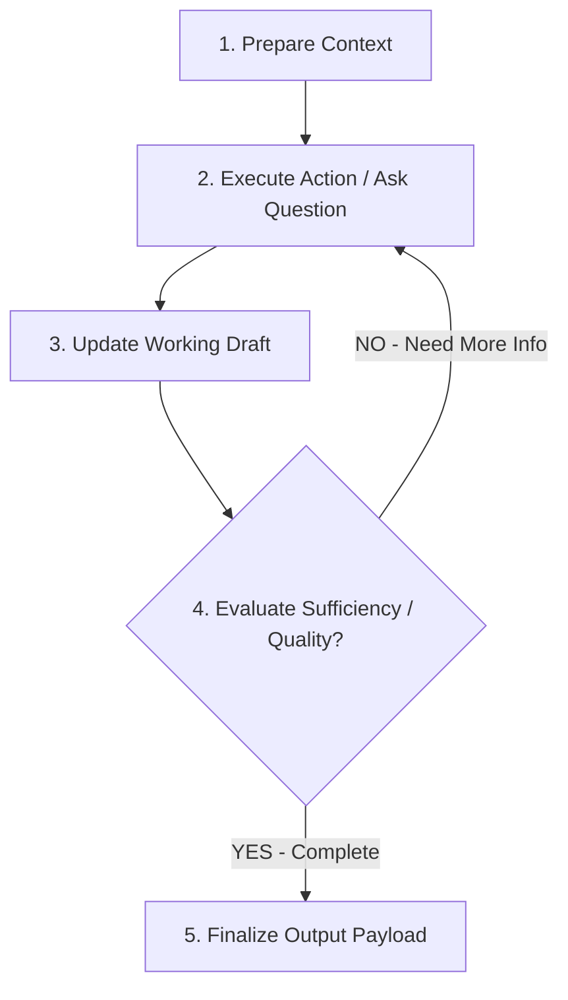

# Quy chuẩn Xây dựng Kỹ năng Hệ thống (Skill Specification Standard)

> **Tài liệu Định nghĩa Cấu trúc Chuẩn, Vị trí Lưu trữ, Cấu hình YAML Frontmatter (Intent Contract) và Giao ước Đầu ra (Artifact Contract) cho mọi Skill trong Hệ thống Agentic Work (AutoForge)**

---

## 1. Nguyên tắc & Vị trí Lưu trữ chuẩn (Skill Hierarchy Standard)

Tất cả các Kỹ năng (Skills) trong hệ thống được quản lý tập trung tại thư mục [`skills/`](file:///d:/Workspace/Projects/AgenticWork/skills) và phân nhóm theo **Domain/Lĩnh vực chuyên môn**:

```text
skills/
├── ba/                        # Kỹ năng phân tích nghiệp vụ (BA)
│   └── requirements-interview/
│       └── SKILL.md           # File hướng dẫn chính (Bắt buộc)
├── backend/                   # Kỹ năng phát triển Backend (API, DB, Clean Arch)
├── frontend/                  # Kỹ năng phát triển Frontend (React, UI Components)
├── odoo/                      # Kỹ năng chuyên biệt framework Odoo
├── shared/                    # Kỹ năng dùng chung cho mọi Agent (Git, Markdown, JSON)
└── 3rdparty/                  # Thư viện Kỹ năng nhập từ bên thứ ba (Chỉ đọc)
```

> [!IMPORTANT]
> **Quy tắc Vàng:**
> 1. **KHÔNG để Skill trong thư mục `agents/`:** Thư mục `agents/` chỉ dùng để định nghĩa vai trò (Role/Identity) của Agent. Thư mục `skills/` là kho tri thức toàn cục (Global Skill Hub).
> 2. **Tên thư mục Skill (`slug`):** Viết thường, không dấu, phân cách bằng dấu gạch ngang (ví dụ: `requirements-interview`, `react-bits`, `database-migration`).
> 3. **File chính bắt buộc:** Mọi folder skill phải chứa đúng file `SKILL.md`.

---

## 2. Cấu trúc YAML Frontmatter — Hợp đồng Ý định (Intent Contract)

Mỗi file `SKILL.md` **BẮT BUỘC** phải chứa khối YAML Frontmatter ở đầu file. Cấu trúc này được kiểm duyệt bằng JSON Schema [`schemas/skill-manifest.schema.json`](file:///d:/Workspace/Projects/AgenticWork/schemas/skill-manifest.schema.json).

```yaml
---
name: requirements-interview
description: >
  PHỎNG VẤN YÊU CẦU kiểu Socratic để làm rõ yêu cầu trước khi viết spec...
intentCategory: REQUIREMENTS_REFINEMENT
triggers:
  - "làm rõ yêu cầu này"
  - "phỏng vấn yêu cầu"
  - "requirements interview"

# Khai báo tường minh bối cảnh cần Knowledge Agent nạp (Intent Contract)
requires:
  templates:
    - "docs/00-Meta/Templates/Template-Change-Request.md"
  registries:
    - "docs/00-INDEX.md"
---
```

### Chi tiết các trường YAML Bắt buộc:

| Trường | Kiểu dữ liệu | Mô tả |
| :--- | :--- | :--- |
| `name` | `string` | Tên slug định danh duy nhất của Skill. |
| `description` | `string` | Mô tả mục tiêu, bài toán và hoàn cảnh áp dụng Skill. |
| `intentCategory` | `Enum` | Nhóm ý định (`CODE_GEN`, `REQUIREMENTS_REFINEMENT`, `BUG_FIX`, `ARCHITECTURE_DESIGN`, `DOCUMENTATION`, `TESTING`...). |
| `triggers` | `string[]` | Danh sách các cụm từ khóa kích hoạt (VI/EN) để Orchestrator match ý định người dùng. |
| `requires` | `object` | Danh sách tài nguyên phụ thuộc (`templates`, `registries`, `astGraphSymbols`) để **Knowledge Agent** nạp chính xác 100% bối cảnh mà 0 tốn token suy đoán. |

---

## 3. Cấu trúc Thân bài `SKILL.md` (Capability Workflow / Layer 3 Workflow)

> **Mô hình "Capability Workflow":** Skill trong **AgenticWork** không còn là một Prompt dài tĩnh đơn lẻ. Mỗi Skill được mô hình hóa thành một **Workflow đồ thị nhỏ (Layer 3 Workflow)** với các nút bước xử lý, rẽ nhánh điều kiện và vòng lặp tự đánh giá (Loop).

Thân bài Markdown của file `SKILL.md` hướng dẫn Specialist Agent thực thi theo cấu hình Capability Workflow chuẩn sau:

```markdown
# [Tên Kỹ Năng]

## Config (Tham số dự án)
- `{{PROJECT}}` — tên dự án
- `/docs` — thư mục docs vault

## Mục tiêu
[Mô tả cụ thể kết quả sản phẩm cần đạt được]

## Capability Workflow Graph (Layer 3 Workflow)


## Quy trình Tư duy & Các Bước Thực thi
1. **Bước 1: Prepare Context** — Bóc tách bối cảnh do Knowledge Agent tiêm.
2. **Bước 2: Execute Action / Ask Question** — Thực hiện phỏng vấn/suy luận logic.
3. **Bước 3: Update Working Draft** — Cập nhật bản thảo tạm thời.
4. **Bước 4: Evaluate Completeness (Loop Gate)** — Tự kiểm tra nếu thiếu thông tin thì lặp lại Bước 2.
5. **Bước 5: Finalize Output Payload** — Đóng gói `SpecialistResultContract`.

## Định dạng Đầu ra (Artifact Contract / Output Envelope)
[BẮT BUỘC: Quy định đóng gói JSON Payload theo chuẩn SpecialistResultContract]

## Tiêu chí Nghiệm thu (Gate Criteria)
- [ ] Tiêu chí 1
- [ ] Tiêu chí 2
```

---

## 4. Giao ước Đầu ra Chuẩn hóa (Artifact Contract / Output Envelope)

Mọi Skill (dù là Bespoke hay 3rd-party) khi thực thi **BẮT BUỘC** phải yêu cầu Specialist Agent đóng gói sản phẩm đầu ra theo định dạng JSON Envelope chuẩn `SpecialistResultContract` để gửi cho **Gateway 2 (Review QA)**:

```json
{
  "executionType": "FILE_CREATE", // FILE_CREATE | FILE_MODIFY | FILE_DELETE | CHAT_RESPONSE
  "proposedPayload": [
    {
      "targetPath": "docs/06-Change-Log/CR-YYYY-MMDD-[title].md",
      "content": "...Nội dung file..."
    }
  ],
  "chatMessage": "Thông báo ngắn gọn kết quả cho người dùng trên IDE...",
  "metadata": {
    "skillUsed": "[skill-name-slug]",
    "affectedModules": ["MODULE_NAME"]
  }
}
```

---

## 5. Quy trình Xử lý Kỹ năng Bên thứ ba (3rd-Party Skills Pipeline)

Đối với các Skill tải từ bên thứ ba (GitHub repos, Obsidian Hub, Cursor skills, NPM packages):

1. **Ingestion & Adapter Pipeline:** Khi cài đặt, **Skill Engine Parser** quét file thô:
   - Nếu thiếu YAML Frontmatter $\rightarrow$ Tự động sinh file sidecar `.[skill-name].meta.json` để đăng ký vào **Skill Registry**.
   - Nếu repo lớn (ví dụ: `react-bits`) $\rightarrow$ Tạo file `catalog.json` phục vụ **Chỉ mục 2 Tầng (Hierarchical Lazy-Loading)**.
2. **Output Interception:** Đăng ký bộ bọc (wrapper) để tự động bắt và đóng gói kết quả của Skill bên thứ 3 vào **Output Envelope** trước khi chuyển cho Gateway 2.

---

## 6. Mẫu Khởi tạo Quick-Start Template

Khi tạo một Skill mới cho hệ thống, hãy tham khảo và copy mẫu chuẩn tại:
👉 **[`docs/00-Meta/Templates/Template-Skill.md`](file:///d:/Workspace/Projects/AgenticWork/docs/00-Meta/Templates/Template-Skill.md)**

---
*Tài liệu được khởi tạo tự động tại `docs/02-Skill-Specification-Standard.md` và gắn kèm JSON Schema `schemas/skill-manifest.schema.json`.*
