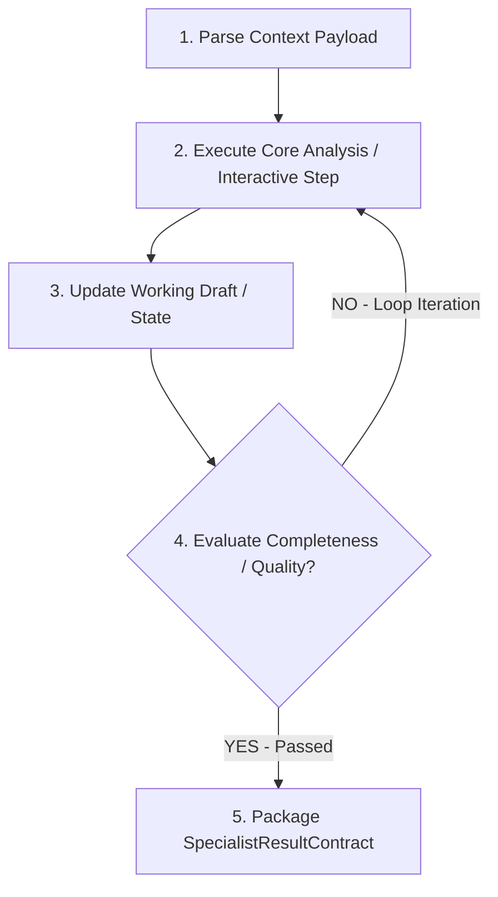

# {{SKILL_TITLE}}

## Config (Tham số dự án — Tự động Inject từ Glossary / glossary.yaml)
- `{{PROJECT_NAME}}` — Tên dự án sản phẩm nghiệp vụ
- `{{DOC_VAULT}}` — Thư mục tài liệu tri thức (VD: `docs/`)
- `{{PRIMARY_DOC_LANGUAGE}}` / `{{SECONDARY_DOC_LANGUAGE}}` — Ngôn ngữ viết tài liệu và giao tiếp (VD: `Vietnamese` / `English`)

## Mục tiêu
Mô tả rõ ràng kết quả cụ thể mà Skill này phải đạt được sau khi thực thi.

## Nguyên tắc Cốt lõi
1. **Zero-hallucination:** Không tự bịa thông tin chưa được xác nhận.
2. **Tuân thủ Tiêu chuẩn:** Mọi đầu ra phải tuân thủ Hợp đồng Dữ liệu `SpecialistResultContract`.
3. **Capability Workflow (Layer 3 Workflow):** Mô hình hóa quy trình xử lý thành đồ thị các bước có rẽ nhánh điều kiện và vòng lặp tự đánh giá.

## Capability Workflow Graph (Layer 3 Workflow)


## Quy trình Tư duy & Các Bước Thực thi
1. **Bước 1: Parse Context Payload** — Đọc và đối chiếu dữ liệu do Knowledge Agent nạp.
2. **Bước 2: Execute Core Analysis / Interactive Step** — Áp dụng quy tắc chuyên môn giải quyết bài toán.
3. **Bước 3: Update Working Draft / State** — Cập nhật bản thảo kết quả trung gian.
4. **Bước 4: Evaluate Completeness / Quality (Loop Gate)** — Kiểm tra xem kết quả đã đáp ứng yêu cầu chưa; nếu chưa, thực hiện vòng lặp Loop về Bước 2.
5. **Bước 5: Package SpecialistResultContract** — Đóng gói kết quả đầu ra chuẩn hóa.

## Định dạng Đầu ra (Artifact Contract / Output Envelope)
Agent thực thi skill này **BẮT BUỘC** phải đóng gói kết quả theo chuẩn `SpecialistResultContract` (Output Envelope) gửi tới Gateway 2 (Review QA) kiểm duyệt:

```json
{
  "executionType": "FILE_CREATE", // FILE_CREATE | FILE_MODIFY | FILE_DELETE | CHAT_RESPONSE
  "proposedPayload": [
    {
      "targetPath": "đường/dẫn/file/mục/tiêu.ext",
      "content": "...Nội dung file..."
    }
  ],
  "chatMessage": "Mô tả ngắn gọn kết quả gửi cho người dùng trên IDE...",
  "metadata": {
    "skillUsed": "{{SKILL_NAME_SLUG}}",
    "affectedModules": ["MODULE_NAME"]
  }
}
```

## Tiêu chí Nghiệm thu (Gate Criteria)
- [ ] Đầu ra tuân thủ đúng template.
- [ ] Không có mâu thuẫn với Business Rules.
- [ ] Đã kiểm tra lỗi cú pháp và linter.
