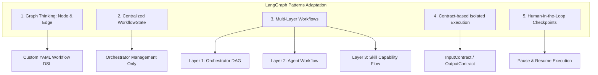

# 📜 Tiêu chuẩn Bộ khung: Quy tắc Thiết kế & Vận hành Workflow Engine (LangGraph Patterns Adaptation)

> **Mã tiêu chuẩn:** `STD-FW-002`  
> **Phạm vi áp dụng:** Toàn bộ Động cơ Điều phối (Orchestrator Engine), Sub-Agents, Skill Hub, Runtime Engine và Gateway trong bộ khung AgenticWork.  
> **Vị trí tài liệu:** `docs/07-Process/_standards/Workflow-Engine-Standard.md` *(Tiêu chuẩn bộ khung framework)*  
> **Tuân thủ:** Phải tuân thủ tuyệt đối tiêu chuẩn `STD-FW-001` (Glossary & Decoupled Path Aliases).

---

## 1. Lý do & Mục tiêu

Trong các hệ thống Multi-Agent phức tạp, các framework như LangGraph đã chứng minh tính hiệu quả của mô hình hóa workflow dưới dạng **Graph (Node, Edge, State, Condition, Loop, Parallel)**. Tuy nhiên, việc phụ thuộc trực tiếp vào SDK/API của một framework bên thứ ba mang lại các rủi ro:
1. **Framework Lock-in:** Bị ràng buộc cú pháp (`StateGraph`, `add_node`, `compile()`), khó tùy biến cho kiến trúc 4 tầng riêng biệt của dự án.
2. **Shared State Mutation:** LangGraph cho phép các Node chỉnh sửa trực tiếp chung một State object, dễ gây ra xung đột race-condition và mất kiểm soát nguồn gốc thay đổi dữ liệu trong hệ thống Đa tác tử.
3. **Agent Communication hỗn loạn:** Giao tiếp trực tiếp giữa Agent với Agent (Peer-to-Peer) làm mất khả năng quản lý tập trung và kiểm duyệt an toàn của Orchestrator & Gateways.

**Tiêu chuẩn `STD-FW-002` ra đời để áp dụng các Pattern tư duy ưu việt của LangGraph mà KHÔNG phụ thuộc vào framework, đồng thời bảo vệ toàn vẹn kiến trúc riêng của AgenticWork.**

---

## 2. Các Nguyên tắc Cốt lõi của Workflow Engine

### Quy tắc 1: Graph Thinking — Mô hình hóa thành Node & Edge
* Mọi quy trình trong hệ thống đều được biểu diễn dạng Đồ thị (Graph).
* **Node KHÔNG PHẢI LÀ HÀM THUẦN TÚY (Function):** Node là **Agent** (ở Layer 1 & 2) hoặc **Skill / Capability** (ở Layer 3).
* **Edge:** Định nghĩa thứ tự thực thi, phụ thuộc dữ liệu và nhánh rẽ điều kiện.

### Quy tắc 2: Centralized `WorkflowState` — Quản lý Trạng thái Tập trung
* `WorkflowState` thuộc quyền sở hữu **ĐỘC QUYỀN của Orchestrator**.
* Các Sub-Agent **hoàn toàn Stateless**, **KHÔNG ĐƯỢC** phép trực tiếp đọc/ghi/sửa đổi biến trong `WorkflowState`.
* Sub-Agent chỉ nhận dữ liệu được Orchestrator đóng gói sẵn qua `AgentDispatchContract` và trả kết quả qua `SpecialistResultContract`. Orchestrator chịu trách nhiệm hợp nhất (merge) dữ liệu trả về vào `WorkflowState`.

### Quy tắc 3: Centralized Routing — Không Giao tiếp Agent-to-Agent
* Tuyệt đối **KHÔNG CHO PHÉP** Agent này gọi trực tiếp Agent khác (No Peer-to-Peer Agent Conversation).
* Mọi chuyển giao nhiệm vụ phải đi qua Orchestrator:
  $$\text{Agent A} \longrightarrow \text{Orchestrator} \longrightarrow \text{Gateway / Review QA} \longrightarrow \text{Orchestrator} \longrightarrow \text{Agent B}$$

### Quy tắc 4: Kiến trúc 3 Tầng Workflow (Multi-Layer Architecture)
Hệ thống phân tách thành 3 cấp độ Workflow rõ ràng:
1. **Layer 1: Orchestrator Workflow (High-Level DAG):** Quản lý luồng tương tác tổng thể giữa các Agent trong hệ thống (Planner $\rightarrow$ Knowledge $\rightarrow$ Specialist Agents $\rightarrow$ Gateways $\rightarrow$ Action Agents).
2. **Layer 2: Agent Workflow (Agent Internal Flow):** Luồng tư duy nghiệp vụ nội bộ của từng Sub-Agent để hoàn thành chỉ thị từ `AgentDispatchContract`.
3. **Layer 3: Skill Workflow (Capability Execution Flow):** Mô hình hóa bản thân từng Skill dưới dạng một **Capability Workflow** (gồm các bước rà soát context, đặt câu hỏi, cập nhật bản thảo, tự đánh giá completeness, vòng lặp Loop...). Skill không còn là một đoạn Prompt dài đơn lẻ.

### Quy tắc 5: Đa dạng Luồng Đồ thị (Edges & Execution Control)
Workflow Engine hỗ trợ đầy đủ các kiểu luồng điều khiển:
* **Direct Edge:** Chuyển giao nối tiếp từ Node A sang Node B (`next: node_b`).
* **Conditional Edge:** Rẽ nhánh dựa trên kết quả kiểm tra điều kiện hoặc phản hồi từ Gateway (`condition: { approved: "action", rejected: "architect" }`).
* **Loop (Iterative Refinement):** Vòng lặp tư duy tự cải thiện (ví dụ phỏng vấn Socratic hoặc sửa lỗi Linter theo Retry Loop Counter).
* **Parallel Edge (DAG Execution):** Cho phép Orchestrator phát lệnh thực thi song song các task độc lập (ví dụ Backend & Frontend tasks).
* **Checkpoint & Pause/Resume:** Điểm đóng băng trạng thái khi cần sự phê duyệt thủ công của người dùng (**Human-in-the-Loop**) tại Gateway 1 hoặc Gateway 2.

### Quy tắc 6: Ngôn ngữ Khai báo Khung quy trình (Custom DSL & Decoupled Contracts)
* Cấu hình quy trình được định nghĩa bằng file YAML/JSON tuân thủ `WorkflowDefinitionContract`.
* Mọi khai báo Contract trong quy trình phải dùng **Logical Contract Name** và **Path Aliases** theo tiêu chuẩn `STD-FW-001`.

---

## 3. Tiêu chí Nghiệm thu & Tuân thủ (Compliance Checklist)

- [x] Không sử dụng bất kỳ thư viện hoặc lệnh API trực tiếp nào của LangGraph framework (`StateGraph`, `add_node`, `compile`).
- [x] Sub-Agent không chứa logic đọc/sửa đổi trực tiếp `WorkflowState`.
- [x] Mọi giao tiếp giữa các Agent bắt buộc phải thông qua trung gian Orchestrator.
- [x] Mọi Skill mới được định nghĩa phải theo mô hình Capability Workflow (Layer 3 Workflow) có quy trình xử lý rõ ràng.
- [x] File định nghĩa Workflow DSL phải tuân thủ JSON Schema được khai báo qua Logical Name `WorkflowDefinitionContract`.
- [x] Mọi tài liệu liên quan được cập nhật tập trung tại `docs/07-Process/_standards/`.
