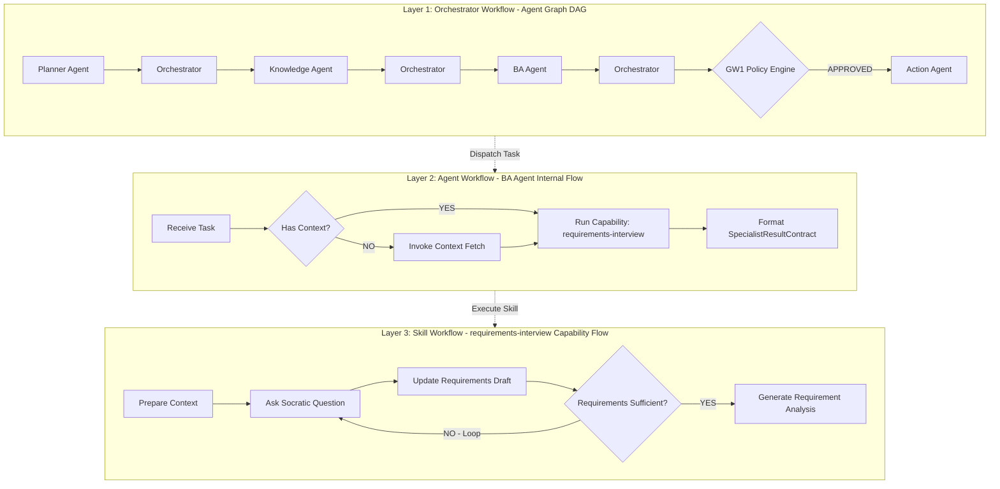

# 📘 Đặc tả Kỹ thuật Workflow Engine (Multi-Agent Workflow Engine Specification)

> **Tài liệu Chi tiết về Mô hình hóa Đồ thị, Quản lý `WorkflowState`, Kiến trúc 3 Tầng Workflow & Cấu trúc Custom DSL trong Hệ thống AgenticWork (AutoForge)**  
> **Phiên bản:** 1.0.0  
> **Phân loại:** Framework Technical Specification  
> **Tiêu chuẩn liên quan:** [`STD-FW-001`](file:///d:/Workspace/Projects/AgenticWork/docs/07-Process/_standards/Glossary-And-Path-Aliases-Standard.md) & [`STD-FW-002`](file:///d:/Workspace/Projects/AgenticWork/docs/07-Process/_standards/Workflow-Engine-Standard.md)

---

## 1. Tổng quan & Triết lý Thiết kế (Design Philosophy)

Workflow Engine của **AgenticWork** lấy cảm hứng từ các pattern cốt lõi của **LangGraph** (Graph Thinking, State Machine, Conditional Edge, Loop, Parallel DAG, Checkpoint), nhưng **tự thiết kế và hiện thực 100% bằng mã nguồn nội bộ (Framework-Independent)**.

### So sánh Kiến trúc:

```text
               LangGraph (Ideas & Patterns)
                            │
     ┌──────────────────────┼──────────────────────┐
     ▼                      ▼                      ▼
State Machine            Graph/DAG           Conditional Flow
     │                      │                      │
     └──────────────────────┼──────────────────────┘
                            ▼
                  Our Workflow Engine
                            │
     ┌──────────────────────┼──────────────────────┐
     ▼                      ▼                      ▼
Orchestrator          Agent Workflow         Skill Workflow
(Layer 1)               (Layer 2)              (Layer 3)
     │                      │                      │
     └──────────────────────┼──────────────────────┘
                            ▼
                 Contract-based Execution
                            │
                            ▼
                  Gateway → Action Agent
```

---

## 2. Quản lý Trạng thái Trung tâm (`WorkflowState`)

Trong kiến trúc của chúng ta, **State thuộc về Orchestrator**. Các Agent là các đơn vị tính toán độc lập (Stateless Compute Nodes). Agent nhận **Input Contract** từ Orchestrator và trả lại **Output Contract**. Agent tuyệt đối **KHÔNG ĐƯỢC** trực tiếp đột biến (mutate) `WorkflowState`.

### Cấu trúc TypeScript Interface của `WorkflowState`:

```typescript
export interface WorkflowState {
  // Trích xuất từ BaseContract / Distributed Tracing
  traceId: string;                 // UUID duy nhất theo vết cả request
  workflowId: string;              // ID của quy trình (e.g. "feature-dev-dag")
  
  // Trạng thái Quản lý Luồng
  status: 'RUNNING' | 'PAUSED_FOR_HUMAN' | 'WAITING_INPUT' | 'COMPLETED' | 'FAILED';
  currentStep: {
    nodeId: string;                // ID nút hiện tại
    nodeType: 'AGENT' | 'SKILL' | 'GATEWAY' | 'PARALLEL_GROUP';
    startedAt: string;
  };
  
  // Ngữ cảnh & Đồ thị Công việc
  goal: string;                    // Prompt / Mục tiêu gốc của người dùng
  taskDAG?: {
    dagId: string;
    tasks: Array<{
      taskId: string;
      assignedRole: string;
      status: 'PENDING' | 'IN_PROGRESS' | 'COMPLETED' | 'FAILED';
    }>;
  };
  
  // Kết quả thực thi tích lũy (ReadOnly với Agent, ReadWrite với Orchestrator)
  completedTasksPayloads: Record<string, any>; // [taskId] -> Output Contract Payload
  artifacts: Array<{
    targetPath: string;
    executionType: 'FILE_CREATE' | 'FILE_MODIFY' | 'FILE_DELETE';
    lastModifiedBy: string;
  }>;
  
  // Context tri thức đã nạp từ Knowledge Agent
  knowledgeContext?: {
    subgraphsCount: number;
    businessRulesCount: number;
    tokenCount: number;
  };

  // Nhật ký Chuyển trạng thái & Checkpoint
  executionHistory: Array<{
    stepNumber: number;
    fromNode: string;
    toNode: string;
    transitionType: 'DIRECT' | 'CONDITIONAL' | 'LOOP' | 'PARALLEL_SPLIT' | 'CHECKPOINT';
    timestamp: string;
  }>;
}
```

---

## 3. Kiến trúc 3 Tầng Workflow (Multi-Layer Workflows)

Workflow Engine vận hành xuyên suốt ở 3 cấp độ abstraction:



1. **Layer 1: Orchestrator Workflow (Agent Graph DAG):**
   - Đồ thị mức cao nhất giữa các Agent.
   - Điều phối tuần tự/song song qua Orchestrator: `Planner → Knowledge → Specialist Agent → Gateway → Action Agent`.
2. **Layer 2: Agent Workflow (Agent Internal Flow):**
   - Quy trình tư duy nội bộ của từng Sub-Agent để xử lý một task cụ thể trong DAG.
3. **Layer 3: Skill Workflow (Capability Execution Flow):**
   - Bản thân mỗi Skill là một **Capability Graph** bao gồm các nút nhỏ (`Prepare → Ask → Update → Evaluate → Loop → Finalize`).

---

## 4. Các Loại Node, Edge & Kiểm soát Luồng (Control Flow Mechanics)

### 4.1 Loại Node (Node Types)
- **`AGENT` Node:** Giao nhiệm vụ cho một Sub-Agent qua `AgentDispatchContract`.
- **`SKILL` Node:** Thực thi một Capability Workflow độc lập.
- **`GATEWAY` Node:** Chốt chặn kiểm duyệt an toàn (`GW1_POLICY_ENGINE` hoặc `GW2_REVIEW_QA`).
- **`PARALLEL_GROUP` Node:** Gom nhóm nhiều node chạy song song theo mô hình DAG.

### 4.2 Loại Edge & Rẽ nhánh (Edges & Conditions)
- **Direct Edge:**
  ```yaml
  planner:
    next: knowledge
  ```
- **Conditional Edge:**
  ```yaml
  gateway:
    condition:
      field: "policyStatus"
      operator: "EQUALS"
      match:
        "APPROVED": action
        "CONFLICT_DETECTED": human_review
        "REJECTED": architect
  ```
- **Loop Edge (Vòng lặp Chẩn đoán & Sửa đổi):**
  ```yaml
  interview_skill:
    condition:
      field: "isSufficient"
      operator: "EQUALS"
      match:
        true: requirement_analysis
        false: interview_skill # Vòng lặp Loop
  ```
- **Checkpoint (Human-in-the-Loop):**
  Khi gặp node hoặc điều kiện yêu cầu phê duyệt thủ công (`requireHumanApproval: true`), Orchestrator đóng đĩa snapshot `WorkflowState` xuống cache/DB, đổi `status` thành `PAUSED_FOR_HUMAN` và phát tín hiệu cho Dashboard. Người dùng phê duyệt xong, Orchestrator `Resume` từ Checkpoint mà không cần chạy lại từ đầu.

---

## 5. Ngôn ngữ Cấu hình Quy trình Custom DSL (YAML Specification)

File định nghĩa Workflow DSL được viết bằng YAML và kiểm duyệt bởi Schema `schemas/workflow-definition.schema.json` (Logical Contract Name: `WorkflowDefinitionContract`).

### Ví dụ File Workflow DSL Chuẩn (`workflows/feature-dev.workflow.yaml`):

```yaml
version: "1.0.0"
workflow:
  id: "feature-development-pipeline"
  name: "Standard Feature Development DAG"
  description: "Workflow phát triển tính năng đầy đủ từ Planner, BA, Architect đến Action Agent"
  startNode: "planner"
  checkpointPolicy: "ON_GATEWAY_OR_HUMAN"

  nodes:
    planner:
      type: "AGENT"
      assignedRole: "PLANNER_AGENT"
      inputContract: "AgentDispatchContract"
      outputContract: "TaskDAGContract"
      next: "knowledge"

    knowledge:
      type: "AGENT"
      assignedRole: "KNOWLEDGE_AGENT"
      inputContract: "TaskDAGContract"
      outputContract: "ContextPayloadContract"
      next: "policy_gateway"

    policy_gateway:
      type: "GATEWAY"
      gatewayType: "GW1_POLICY_ENGINE"
      inputContract: "ContextPayloadContract"
      outputContract: "PolicyVerificationContract"
      condition:
        field: "status"
        operator: "EQUALS"
        match:
          "APPROVED": "specialist_parallel_group"
          "CONFLICT_DETECTED": "checkpoint_human"
          "REJECTED": "architect_fix"

    checkpoint_human:
      type: "CHECKPOINT"
      description: "Tạm dừng quy trình chờ người dùng phê duyệt xung đột Business Rules trên Dashboard"
      resumeNode: "specialist_parallel_group"

    specialist_parallel_group:
      type: "PARALLEL_GROUP"
      joinStrategy: "ALL_COMPLETED"
      branches:
        - "ba_spec_branch"
        - "architect_spec_branch"
      next: "review_qa_gateway"

    ba_spec_branch:
      type: "AGENT"
      assignedRole: "BA_AGENT"
      capabilityWorkflow: "requirements-interview"
      outputContract: "SpecialistResultContract"

    architect_spec_branch:
      type: "AGENT"
      assignedRole: "ARCHITECT_AGENT"
      capabilityWorkflow: "architecture-design"
      outputContract: "SpecialistResultContract"

    review_qa_gateway:
      type: "GATEWAY"
      gatewayType: "GW2_REVIEW_QA"
      inputContract: "SpecialistResultContract"
      outputContract: "ReviewQAContract"
      condition:
        field: "status"
        operator: "EQUALS"
        match:
          "PASSED": "action_executor"
          "FAILED": "specialist_retry_loop"

    specialist_retry_loop:
      type: "AGENT"
      assignedRole: "CODER_AGENT"
      isRetryNode: true
      maxRetries: 3
      next: "review_qa_gateway"

    action_executor:
      type: "ACTION_AGENT"
      assignedRole: "FILE_SYSTEM_AGENT"
      inputContract: "DiskWriteContract"
      end: true
```

---

## 6. Tiêu chuẩn Mã nguồn & Tích hợp

1. **Logical Contract Binding:** Động cơ Workflow Engine giải mã Logical Name trong `WorkflowDefinitionContract` thông qua `config/glossary.yaml` (tiêu chuẩn `STD-FW-001`).
2. **Stateless Compliance:** Mọi Sub-Agent khi được thực thi bởi Workflow Engine tuyệt đối không lưu vết trạng thái phiên giữa các lần gọi.
3. **Tracing Preservation:** Mọi sự di chuyển giữa các Node/Edge trong Workflow Engine đều ghi log chứa `traceId`.
