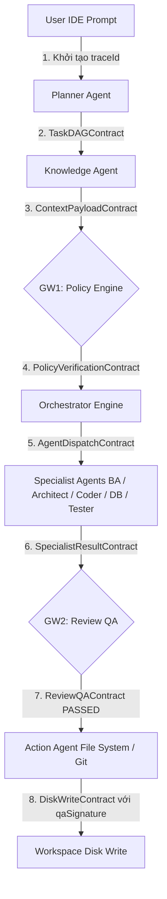

# Antigravity AgenticWork - JSON Schemas & Data Contracts Repository

> Thư mục lưu trữ các **JSON Schemas (Draft-07)** định nghĩa toàn bộ **Hợp đồng Dữ liệu (Data Contracts)**, **Workflow DSL**, và **Skill Manifest** trong hệ thống AgenticWork (AutoForge).

---

## 1. Tổng quan Kiến trúc Hợp đồng Dữ liệu (Overview)

Trong kiến trúc 4 tầng của hệ thống **AgenticWork**, mọi giao tiếp dữ liệu giữa **Orchestrator**, các **Sub-Agent**, **Gateways**, và **Action Agent** đều tuân thủ nguyên tắc **Strict Typing & Zero-Untyped-Messaging**. Thư mục [`schemas/`] đóng vai trò là "Single Source of Truth" quy định cấu trúc gói tin dữ liệu chuẩn.

### 📌 Các Nguyên tắc Vàng (Core Principles):
1. **Phân định Ranh giới Nhiệm vụ & Khả năng Kiểm tra (Contract-driven Boundaries):** Không truyền văn bản tự do không cấu trúc giữa các Agent. Tất cả gói tin phải đóng gói theo Hợp đồng Dữ liệu tương ứng.
2. **Định vết Xuyên suốt (Distributed Tracing với `traceId`):** Tất cả Hợp đồng Dữ liệu giao tiếp tin nhắn đều kế thừa từ [`base-contract.schema.json`], mang theo `traceId` duy nhất từ IDE đến lúc ghi đĩa.
3. **Rào chắn Thực thi (Execution Barrier):** Action Agent (`FILE_SYSTEM_AGENT`, `GIT_AGENT`, ...) chỉ thực thi các thao tác ghi đĩa khi gói tin [`disk-write.schema.json`] mang chữ ký phê duyệt `qaSignature` hợp lệ từ Gateway 2 (`GW2_REVIEW_QA`).
4. **Bất biến trạng thái Workflow (WorkflowState Isolation):** Chỉ Orchestrator mới có quyền quản lý và cập nhật `WorkflowState`. Các Sub-Agent hoạt động theo cơ chế Stateless.

---

## 2. Luồng Dữ liệu & Quy trình Giao tiếp (Data Flow)

Sơ đồ dưới đây minh họa luồng chuyển dịch dữ liệu và các JSON Schema tương ứng được áp dụng qua từng giai đoạn xử lý quy trình:

---

## 3. Danh mục & Chi tiết các JSON Schemas

| Tên File Schema | Logical Contract Name | Mô tả Chức năng | Phân loại |
| :--- | :--- | :--- | :--- |
| `base-contract.schema.json`| `BaseContract` | Định nghĩa các giao tiếp chung giữa các agent. Mọi giao tiếp agent đều kế thừa base contract này. | System Header |
| `workflow-definition.schema.json` | `WorkflowDefinitionContract` | Định nghĩa ngôn ngữ khai báo quy trình (Custom DSL) cho Workflow Engine. | DSL Config |
| `task-dag.schema.json` | `TaskDAGContract` | Đồ thị Công việc (Task DAG) được tạo bởi Planner Agent. | Message Contract |
| `context-payload.schema.json` | `ContextPayloadContract` | Bối cảnh Công việc (Context Payload) được tạo bởi Knowledge Agent. | Message Contract |
| `policy-verification.schema.json` | `PolicyVerificationContract` | Kết quả Kiểm duyệt Chính sách (Policy Verification Result) từ GW1. | Gateway Verification |
| `agent-dispatch.schema.json` | `AgentDispatchContract` | Lệnh Phân công Agent (Agent Dispatch Command) từ Orchestrator. | Orchestration |
| `specialist-result.schema.json` | `SpecialistResultContract` | Kết quả chuyên môn từ Specialist Agents về Orchestrator/GW2. | Message Contract |
| [`review-qa.schema.json`] | `ReviewQAContract` | Kết quả kiểm định hậu thực thi (Linter, Syntax, Business Rules) từ GW2 kèm `qaSignature`. | Gateway Verification |
| [`disk-write.schema.json`] | `DiskWriteContract` | Hợp đồng thao tác ghi đĩa an toàn (Atomic File Ops + Rollback Snapshot) cho Action Agent. | Action Execution |
| [`skill-manifest.schema.json`] | `SkillManifestSchema` | Schema kiểm duyệt YAML Frontmatter trong các file `SKILL.md` (Skill Intent & Dependencies). | Skill Manifest |

---

## 4. Quy trình Cập nhật & Mở rộng Schema (Maintainability Guidelines)

1. **Khả năng Tương thích Ngược (Backward Compatibility):**
   * Không xóa hoặc đổi tên các thuộc tính `required` đã công bố trừ khi nâng phiên bản Major.
   * Tất cả các trường mới bổ sung nên để ở dạng tùy chọn (`optional`) hoặc có giá trị mặc định (`default`).
2. **Kế thừa Đúng chuẩn:**
   * Mọi Message Contract mới được định nghĩa phải bổ sung `allOf: [{ "$ref": "base-contract.schema.json" }]` và khai báo hằng số `contractType`.
3. **Đồng bộ hóa Tài liệu:**
   * Khi cập nhật JSON Schema trong `schemas/`, bắt buộc phải đồng bộ hóa tài liệu kiến trúc tại [`docs/01-Agent-Data-Contracts.md`]
