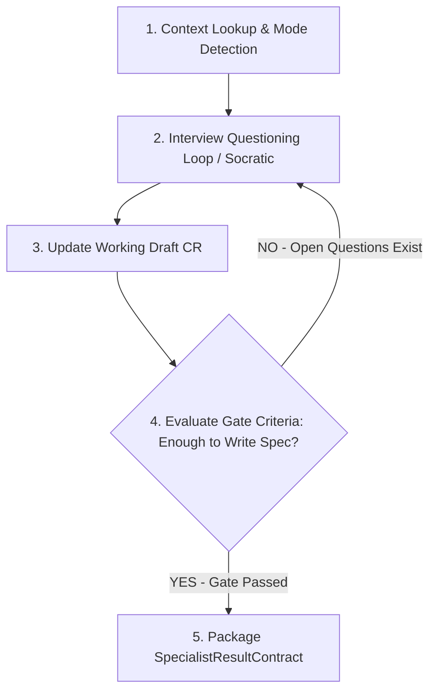

# Requirements Interview — Phỏng vấn yêu cầu kiểu Socratic

## Config (điền khi áp vào dự án)
- `{{PROJECT}}` — tên dự án
- `/docs` — thư mục docs vault
- `{{LANG_PRIMARY}}` / `{{LANG_SECONDARY}}` — ngôn ngữ (mặc định VI + EN)

## Mục tiêu
Biến một yêu cầu mơ hồ thành **một Change Request đủ rõ để viết spec**, bằng cách **HỎI người dùng (BA) theo tầng** thay vì đoán. Không viết spec ở đây — chỉ làm rõ và đóng gói thành CR nháp + danh sách câu hỏi cần xác nhận.

## Nguyên tắc cốt lõi (đọc trước mỗi lần dùng)
1. **Zero-hallucination — không bịa ý khách.** Mọi điều CHƯA được người dùng/khách xác nhận đều phải ghi vào mục **OPEN QUESTIONS**, không được viết như sự thật trong CR. Trích nguồn khi có (biên bản họp, message, ticket).
2. **Hỏi từng tầng, không dồn một lúc.** Mỗi lượt hỏi 1 nhóm chủ đề; xác nhận hiểu đúng rồi mới sang nhóm kế. Dùng `AskUserQuestion` để gom 2–4 lựa chọn khi câu hỏi có phương án rõ; hỏi mở (text) khi cần mô tả.
3. **Đào "vì sao" nhiều lớp (Phân biệt Problem vs Solution).** Stakeholder thường nói ra *giải pháp họ nghĩ sẵn* thay vì *vấn đề của họ* (Ví dụ: khách bảo *"Anh cần export Excel báo cáo hàng ngày"* $\rightarrow$ thực ra pain-point là *"muốn gửi mail cho sếp mỗi sáng"*). Nhiệm vụ của BA KHÔNG PHẢI là ghi lại giải pháp bề nổi, mà là đào đủ sâu để tìm ra nỗi đau (pain-point) thực sự.
4. **Chống Solution Jumping (Dùng khi yêu cầu còn lờ mờ / Dự án mới):** Khi nhận một yêu cầu (như *"Em muốn thêm field này trong form"* $\rightarrow$ thực ra họ muốn không phải mở Excel check lại), KHÔNG nhảy ngay vào thiết kế hay ghi nhận giải pháp. Bắt buộc phải lùi lại 1 bước làm rõ: *"Vấn đề thực sự gốc rễ họ đang gặp là gì?"* trước khi chốt phương án.
5. **Cân bằng Tốc độ vs Chất lượng (Tôn trọng chuyên gia & Biết khi nào DỪNG ĐÀO):**
   - **Tôn trọng chuyên gia vận hành:** Không mặc định phủ nhận giải pháp của khách. Phân biệt được: giải pháp từ kinh nghiệm lâu năm (cần xác nhận nhanh) vs giải pháp bắt chước/nghĩ nhất thời (cần đào sâu).
   - **Tránh Analysis Paralysis (Tê liệt vì phân tích):** Không sa vào việc gạn hỏi quá đà. Ngay khi thông tin đạt đủ **Tiêu chí Gate (Problem + Expected Behavior + Scope rành mạch)**, lập tức DỪNG HỎI và chốt nháp CR để không làm trễ tiến độ dự án.

## Hai chế độ — tự nhận diện
- **Chế độ A — CLARIFY (mặc định):** yêu cầu đã có hình hài, chỉ thiếu chi tiết → chạy thẳng khung 11 câu bên dưới.
- **Chế độ B — BRAINSTORM:** yêu cầu còn lờ mờ / "muốn cải thiện X mà chưa biết cách" → **phân kỳ trước, hội tụ sau**:
  1. Làm rõ *problem* và *mục tiêu thành công* (đo bằng gì?).
  2. Đề xuất 2–4 hướng giải pháp (kèm trade-off ngắn), trình bày qua `AskUserQuestion` để người dùng chọn/loại.
  3. Khi đã chốt 1 hướng → chuyển sang Chế độ A để làm rõ chi tiết hướng đó.

## Khung phỏng vấn 11 tầng (Chế độ A)
Hỏi theo thứ tự, mỗi tầng là một lượt (gộp tầng nhỏ nếu người dùng trả lời nhanh):

1. **Problem** — Vấn đề thực sự là gì? Ai đau? Hiện tại họ xoay xở ra sao (workaround)?
2. **Actors / Roles** — Ai dùng tính năng này? (role nào trong hệ thống). Ai bị ảnh hưởng gián tiếp?
3. **Current behavior** — Hệ thống HIỆN TẠI làm gì ở chỗ này? (màn hình/nút/luồng cụ thể). Nếu không rõ → OPEN QUESTION hoặc đề xuất kiểm chứng bằng app.
4. **Expected behavior** — Sau thay đổi, hệ thống PHẢI làm gì? Mô tả luồng bước-một.
5. **Scope & boundaries** — Cái gì NẰM TRONG, cái gì NGOÀI phạm vi lần này? (chặn scope creep).
6. **Edge cases & lỗi** — Trường hợp rỗng/biên/đồng thời/quyền hạn/offline? Báo lỗi ra sao?
7. **Data & fields** — Field nào thêm/sửa/bỏ? Kiểu dữ liệu, bắt buộc?, validate?, giá trị mặc định? Công thức tính (nếu có)?
8. **Modules / màn hình ảnh hưởng** — Đụng module nào trong vault? (đối chiếu `_registry/module-registry` & `02-modules/_MODULE-MAP`). FE/BE/Mobile có liên quan?
9. **Acceptance criteria** — Làm sao biết là XONG ĐÚNG? Viết dạng Given/When/Then hoặc checklist nghiệm thu.
10. **Priority & deadline** — Mức ưu tiên? Hạn? Phụ thuộc việc/khác ai?
11. **Open questions** — Mọi điều còn mơ hồ → gom thành danh sách câu hỏi gửi stakeholder.

> Mỗi tầng: nếu người dùng không chắc → KHÔNG tự điền; đánh dấu `⚠️ cần xác nhận với Khách hàng` và đẩy vào OPEN QUESTIONS.

## Capability Workflow Graph (Layer 3 Workflow)


## Quy trình Thực thi Capability Workflow
1. **Bước 1: Context Lookup & Mode Detection** — Nhận diện chế độ (A - Clarify / B - Brainstorm), đọc `ContextPayloadContract` và tra cứu tài liệu liên quan trong `/docs` để không hỏi trùng.
2. **Bước 2: Interview Questioning Loop** — Phỏng vấn theo khung 11 tầng (Chế độ A) hoặc phân kỳ→hội tụ (Chế độ B). Đặt 1 nhóm câu hỏi / lượt qua `AskUserQuestion`.
3. **Bước 3: Update Working Draft CR** — Soạn và cập nhật Change Request nháp theo đúng `Template-Change-Request.md` trong `00-Meta/Templates`.
4. **Bước 4: Evaluate Gate Criteria (Loop Gate)** — Tự đánh giá xem CR đã đủ rõ để viết spec chưa. Nếu còn thông tin thiếu, lặp lại Bước 2 (đặt câu hỏi tiếp hoặc đẩy vào OPEN QUESTIONS).
5. **Bước 5: Package SpecialistResultContract** — Đóng gói CR nháp và danh sách câu hỏi theo chuẩn `SpecialistResultContract` gửi cho Gateway 2.

## Định dạng Đầu ra (Artifact Contract / Output Envelope)
BA Agent bắt buộc đóng gói kết quả theo chuẩn `SpecialistResultContract` (Output Envelope) để gửi tới Gateway 2 (Review QA) kiểm duyệt trước khi Action Agent lưu file:

```json
{
  "executionType": "FILE_CREATE",
  "proposedPayload": [
    {
      "targetPath": "docs/06-Change-Log/CR-YYYY-MMDD-[ten-cr].md",
      "content": "...Nội dung Change Request đúng chuẩn Template-Change-Request.md..."
    }
  ],
  "chatMessage": "Đã hoàn thành phỏng vấn và tạo bản nháp CR. Dưới đây là danh sách câu hỏi cần xác nhận thêm với Khách hàng...",
  "metadata": {
    "skillUsed": "requirements-interview",
    "affectedModules": ["SALE", "CRM"]
  }
}
```

## Ghi chú model-routing & token (tùy chọn, để tiết kiệm)
- Việc **suy luận/đào sâu/soạn CR** → giữ model mạnh cho chất lượng.
- Việc **máy móc** (đổi định dạng, dịch song ngữ, gom danh sách) → có thể hạ model hoặc giao subagent rẻ hơn nếu muốn tiết kiệm; với phiên tương tác bình thường thì không cần.
- Giữ phỏng vấn **gọn**: hỏi đúng cái thiếu, không lặp lại cái người dùng đã trả lời (đỡ tốn context).

## Tiêu chí "đủ rõ để viết spec" (gate trước khi bàn giao)
- [ ] Problem + Expected behavior rõ ràng, không mâu thuẫn.
- [ ] Scope đóng (in/out rành mạch).
- [ ] Field & edge case chính đã liệt kê.
- [ ] Module ảnh hưởng đã map.
- [ ] Acceptance criteria kiểm chứng được.
- [ ] OPEN QUESTIONS đã tách riêng, không lẫn vào phần khẳng định.

Nếu chưa đạt gate → nói rõ còn thiếu gì, đừng bàn giao sang viết spec.
