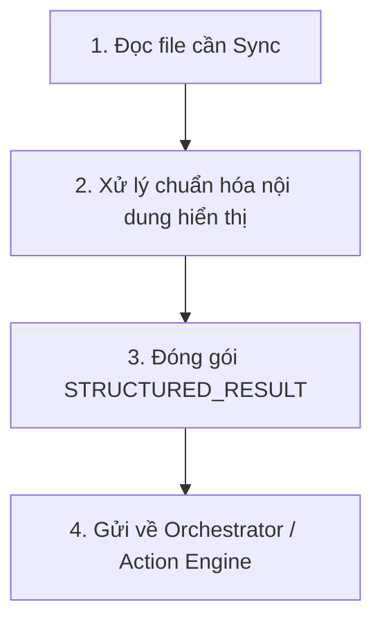

# Đồng bộ Google Drive (sync-drive)

> Skill lo đúng MỘT việc: Đóng gói tài liệu Markdown thành Payload Lệnh (Command Payload) để yêu cầu Hệ thống (Runtime Engine) kết nối API Google Drive và Upload file. Agent tuyệt đối KHÔNG tự gọi HTTP Request.

## Config
- `{{DRIVE_FOLDER_ID}}` — ID thư mục đích trên Drive.

## 1. Task Mindset & Core Principles
- **Delegation Mindset:** Bạn không trực tiếp làm việc này. Bạn là người điền form "Yêu cầu gửi hàng", Hệ thống sẽ là người "Giao hàng".
- **Formatting:** Markdown cần được "chuẩn bị" (loại bỏ các thẻ meta không cần thiết nếu có) để khi hệ thống parse sang PDF/Docs sẽ đẹp nhất.

## 2. Core Execution Rules
1. **Gate:** BẮT BUỘC dùng `executionType: "STRUCTURED_RESULT"`. KHÔNG dùng `FILE_CREATE`.
2. **Payload Type:** Dùng `payloadType: "GoogleDriveSyncCommand"`.

## 3. Quy trình Xử lý (Capability Workflow)


## 4. Definition of Done
- [ ] Output trả về đúng định dạng `STRUCTURED_RESULT` theo chuẩn Agent Template mới nhất.
- [ ] Nội dung (content) được escape JSON hợp lệ.

## 5. Contract Binding
BẮT BUỘC trả về JSON hợp lệ:
```json
{
  "traceId": "<kế thừa>",
  "resultId": "<uuid>",
  "taskId": "<kế thừa>",
  "specialistRole": "DOCUMENT_AGENT",
  "contractType": "SPECIALIST_RESULT",
  "timestamp": "<current_iso_time>",
  "fromAgent": "DOCUMENT_AGENT",
  "toAgent": "ORCHESTRATOR",
  "executionType": "STRUCTURED_RESULT",
  "proposedPayload": [
    {
      "payloadType": "GoogleDriveSyncCommand",
      "payload": {
        "targetFolderId": "{{DRIVE_FOLDER_ID}}",
        "documentTitle": "BRD - Phien Ban Cho Nguoi Doc",
        "documentContent": "...nội dung đã escape JSON...",
        "format": "GOOGLE_DOCS"
      }
    }
  ],
  "chatMessage": "Đã phát lệnh uỷ quyền đồng bộ lên Google Drive. Hệ thống Action Engine sẽ đảm nhận việc upload.",
  "metadata": {
    "skillUsed": "skill-document-sync-drive",
    "affectedModules": ["INTEGRATION"],
    "status": "COMPLETED",
    "version": 1
  }
}
```
